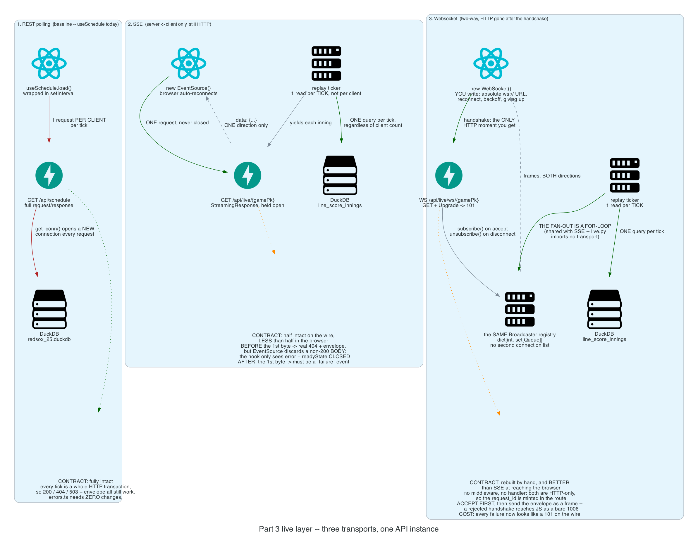
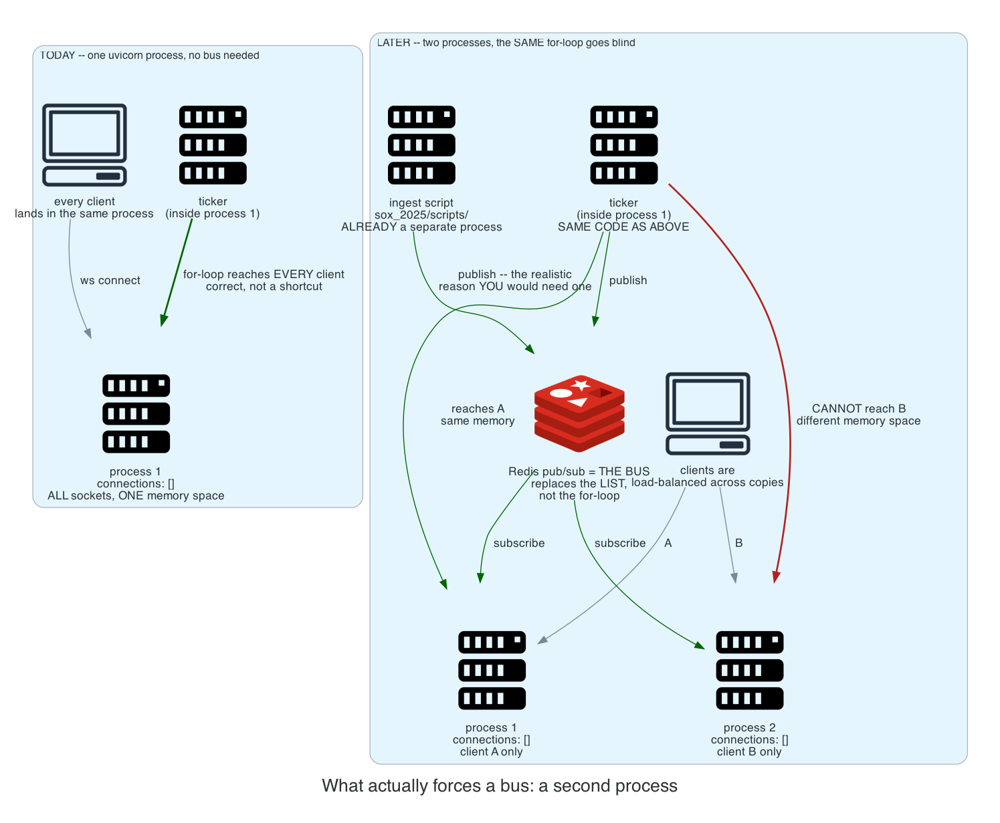

# tenth_inning

A Red Sox 2025 season explorer: a DuckDB warehouse built from MLB StatsAPI data, a
FastAPI read layer over it, and a React frontend that renders the schedule and a
scorecard.

The interesting part isn't the baseball data — it's that the API and the client share
one **error contract**, and every architectural change gets measured against whether
that contract survives it.

---

## Running it

Two terminals. **Terminal 1 — the API:**

```bash
myenv/bin/python -m uvicorn server:app --host 127.0.0.1 --port 8000 --reload
```

**Terminal 2 — the frontend:**

```bash
cd frontend && yarn dev
```

Then open the Vite URL it prints. `/api/*` is proxied to the API, so it's
same-origin and CORS never comes up.

`--host 127.0.0.1` is deliberate: Docker Desktop listens on `*:8000` over IPv6, and
`localhost` can resolve to `::1` and hit Docker instead of the API. Binding and
proxying to `127.0.0.1` keeps both on IPv4.

The DuckDB file (`redsox_25.duckdb`, ~78MB) is gitignored and rebuildable from
`sox_2025/scripts/`. `server.py` fails with an explicit 500 rather than silently
creating an empty database, so a fresh clone tells you what's missing instead of
reporting "table not found" three layers later.

Tests:

```bash
myenv/bin/pytest
```

---

## The error contract

One envelope shape, everywhere:

```json
{"error": {"code": "...", "message": "...", "details": {}, "request_id": "..."}}
```

Three files own it end to end:

| File | Role |
| --- | --- |
| [`errors.py`](errors.py) | Typed `AppError` subclasses, the `ErrorCode` enum, `error_body()` — the single place that knows the envelope's shape — and `failure_frame()`, the same envelope as a message for transports with no status line |
| [`error_handlers.py`](error_handlers.py) | Request-ID middleware plus five exception handlers. All five are required; drop one and a class of failure escapes the envelope. Four answer HTTP; the fifth answers a websocket, where there is no response to return |
| [`frontend/src/api/errors.ts`](frontend/src/api/errors.ts) | The client half — switches on `error.code`, never on the message or the status number |

The rule the whole thing exists to enforce: **4xx if the client sent something wrong,
5xx if the client was fine and we broke.** The test is whether retrying the identical
request could ever succeed.

The payoff is that `RESOURCE_NOT_FOUND` is an *empty state* in the UI, not an error
state. That distinction was impossible when every failure was a 500.

---

## Architecture

Diagrams are generated, not drawn — regenerate them after any design change so they
can't drift:

```bash
myenv/bin/python docs/diagrams/live_layer.py
```

Requires Graphviz on PATH (`brew install graphviz`).

### The live layer: three transports, one API instance

Part 3 builds all three side by side so the trade-offs are visible rather than
asserted. Read each column top to bottom.



Edge colors are consistent across both diagrams: **red** is a cost paid repeatedly,
**green** is the error contract surviving, **orange** is the contract degraded.

What the picture is actually arguing:

- **Polling** does one full HTTP transaction per client per tick, opening a new DuckDB
  connection each time via `get_conn()`. In exchange, the error contract needs *zero*
  changes — every tick carries its own status code.
- **SSE** and **websockets** share one ticker per game, which reads the database
  **once for every client watching**, then fans out. Polling costs one read per client
  per tick. That efficiency argument belongs to both live transports equally, which is
  exactly why it is not an argument *for* websockets.
- The contract degrades differently in each. SSE keeps it for errors raised before the
  first byte and loses it after — the status code is physically on the wire and
  immutable. Websockets have no status line at all past the handshake, so the envelope
  has to be rebuilt inside message frames at both ends.

#### The part building it actually changed

Part 3b was written expecting to confirm that websockets are worse at everything. One
result came out the other way, and it is only visible from a browser:

**A 404 from the SSE route never reaches the client.** `raise ResourceNotFound(...)`
happens before the first byte, so the response is a real 404 carrying the full
envelope — `curl` sees it, the tests see it, the server logs it. But `EventSource`
**discards the body of any non-200 response**. All the hook gets is an `error` event
and `readyState === CLOSED`, so `/api/live/999999` renders as a generic *"Something
went wrong."* with no code and no request id.

The websocket route accepts the socket first and sends the same envelope as a frame,
so the browser renders *"No game with gamePk 999999."* and the request id. Same
server, same error, same envelope — one transport can deliver it to a browser and the
other cannot.

What that costs is real and worth saying out loud: an accepted-then-closed socket is a
`101` on the wire, so every websocket failure looks like a success to proxies,
load balancers and metrics. The status code survives only in the server log:

```
WS /api/live/ws/999999 -> 404 RESOURCE_NOT_FOUND [request_id=45bbdcc2eb5d] No game with gamePk 999999.
```

Adding the transport also forced a **fifth** exception handler. FastAPI's default
websocket validation handler rejects the handshake with close code `1008` and
pydantic's raw error list as the reason — internals that `handle_validation_error`
exists to reshape, on a channel the browser cannot read anyway (a handshake-phase
close reaches JavaScript as a bare `1006`).

**Conclusion: SSE is still the right answer for a read-only score feed** — reconnect,
backoff and heartbeats are free there and are hand-written code in
[`liveSocket.ts`](frontend/src/api/liveSocket.ts) — but the reason is narrower than
"the contract survives better." It doesn't. It survives *differently*, and on the
before-the-first-byte case it survives worse.

### What actually forces a message bus



At one API instance, the `dict[int, set[Queue]]` in [`live.py`](live.py) plus a
for-loop **is** the fan-out. That is correct engineering, not a shortcut. Note that
the websocket route did not add a second registry: `live.py` imports neither `fastapi`
nor `duckdb`, so both live transports subscribe to the same ticker.

A bus replaces **the list**, not the for-loop, and only once the list can no longer see
every client — meaning a second process. The realistic trigger in this repo isn't
scale; it's the ingest scripts in `sox_2025/scripts/`, which are *already* a separate
process and therefore already unable to reach the connection list.

---

## Progress

| Phase | Scope | State |
| --- | --- | --- |
| Part 1 | Error contract: typed errors, one envelope, request-id round trip, five handlers | Done |
| Part 2 | Read endpoints with real validation — `/api/games`, `/api/games/{gamePk}`, `/api/games/{gamePk}/linescore` | Done |
| Part 3 | Live layer: SSE + REST polling, contrasted side by side (`/api/live/{gamePk}`, `live.py`, `frontend/src/api/live.ts`) | Done |
| Part 3b | The websocket version, to feel what it costs (`/api/live/ws/{gamePk}`, `frontend/src/api/liveSocket.ts`) | Done |
| Part 4 | Deploy: one container, real origins, real HTTPS, a health check | Next |

Open work is tracked in `tdl.txt`, which is gitignored — it's a scratch list, not a
spec.
